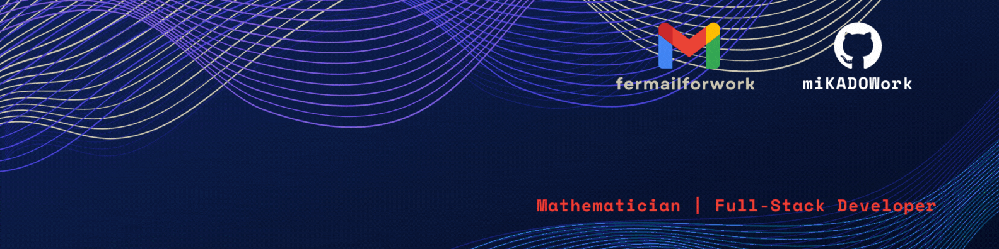

# Hola! Soy ${\color{blue}Fernando Alaejos Garcia}$, 
## Bienvenido a mi Github



## Sobre mi:
Graduado en Matemáticas y Desarrollador Full Stack, además de estudiante en Ciencia de Datos. Fusiono precisión matemática con innovación tecnológica. Apasionado por resolver problemas complejos con soluciones elegantes en desarrollo y análisis de datos. Actualmente, estoy construyendo mi perfil de GitHub, un proyecto en constante evolución y todavia esta verde  pero siguo mejorandolo poco a poco. 😄 

## Los lenguajes en los que suelo programar son:


````diff
+ Futuros proyectos:
- Proyectos actuales:
- Curriculum amazon
````
##  Actualmente: 
- He retomado mi proyecto de Github pages con un clon de la web de Amazon que espero terminar para el mes de Febrero.
- Estoy ordenando los repositorios del bootcamp asi que poco a poco ire subiendo contenido nuevo pero realizado durante los meses de Septiebre hasta Diciembre de 2023 en la Fundació Esplai. 

<!--
**miKADOWork/miKADOWork** is a ✨ _special_ ✨ repository because its `README.md` (this file) appears on your GitHub profile.

Here are some ideas to get you started:

- 🔭 I’m currently working on ...
- 🌱 I’m currently learning ...
- 👯 I’m looking to collaborate on ...
- 🤔 I’m looking for help with ...
- 💬 Ask me about ...
- 📫 How to reach me: ...
- 😄 Pronouns: ...
- ⚡ Fun fact: ...
-->
